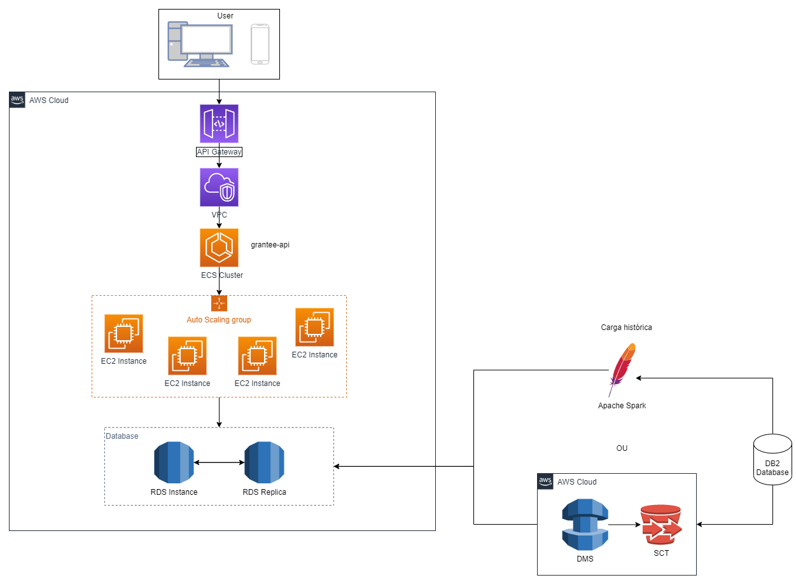
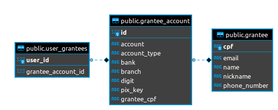

# grantee-api

### Arquitetura geral
Prezando pela simplicidade, não percebi a necessidade de criação de mais de um serviço para a tratar de favorecidos.
Porém, uma melhoria possível, seria a aplicacão do pattern CQRS. Assim, criaríamos dois microserviços, um responsável pela leitura e outro responsável pela escrita dos dados. Logo, o uso de um não afetaria o uso de outro, e é possível alocar recursos separadamente para cada um conforme necessidade.


### Base histórica
Vejo duas possibilidades para adicionarmos a base histórica legada a essa nova estrutura.
1) Via Apache Spark
2) Via AWS Database Migration Service (DMS) e AWS Schema Conversion Tool (SCT)

Assim, conseguimos não ficar dependentes do banco de dados da arquitetura legada e manter tudo nessa nova arquitetura.


### Modelagem de dados
Inicialmente optei por usar um banco de dados relacional, e no case adicionei o PostgreSQL. Em uma possível real solução, caso o paradigma relacional seja realmente aplicado, imagino que por questões contratuais e de diretrizes organizacionais, possamos utilizar o Oracle.

Na questão técnica dos dois, não vejo muita diferença prática em um caso simples como o proposto.

Conforme exemplificado na imagem abaixo, a modelagem foi pensada em três tabelas. São elas:
1) grantee: tabela responsável por armazenar os dados de um favorecido;
2) grantee_account: tabela responsável por armazenar os dados da conta de um favorecido. Um favorecido pode ter N contas;
3) user_grantee: tabela que relaciona os favorecidos com um usuário do sistema. Um usuário pode ter associado a ele N contas de favorecidos;


A tabela user_grantee é a responsável por relacionar os favorecidos cadastrados com os usuários da aplicação. Novamente, prezando pela simplicidade, a api desenvolvida simplesmente recebe o user_id do usuário da aplicação e o relaciona com o favorecido cadastrado. Em um cenário real, o client que usaria a api (internet banking, mobile app, desktop app) deveria se autenticar e por esta, a api relacionaria o cadastro do favorecido com o usuário autenticado.


### Observabilidade

Imagino ser importante monitorar alguns pontos da aplicação de modo geral, em uma aplicação como o New Relic, por exemplo, como a seguir:

- Tempo de resposta
- Erros de negócio (HTTP 4xx)
- Erros da aplicação (HTTP 5xx)
- IOPS do banco de dados
- Tempo de resposta em integrações externas (validações de cpf, nome, etc)
- Apdex
- Requests per second/throughput
- CPU
- Memoria
- Deadlocked Threads

Considero esses itens básicos para o início da monitoria. Com o tempo, analisando o uso da aplicação, pode-se adicionar pontos importantes a serem monitorados ou remover algo eventualmente desnecessário.

Importante salientar que acho fundamental a monitoria de aplicações de duas formas.
- Dashboards: é interessante "ficar de olho" em dashboards periodicamente pois assim é possível entender melhor como estão utilizando a aplicação.
- Alertas: é imprescindível para que sejam criados alertas com base, no mínimo, nos itens citados acima. Importante também definir limites de alerta e de erro, sendo o segundo algo grave que pode estar acontecendo com a aplicação e pode acarretar em uma crise.

<hr>
Disclaimer: 
grantee -> a person who receive a conveyance
<hr>

### App

### Requirements
* Java >= 11.0.7
* Docker and Docker-Compose

### Running app
```shell
./gradlew clean build -x test && docker-compose up -d
```

### Running tests
```shell
./gradlew test
```